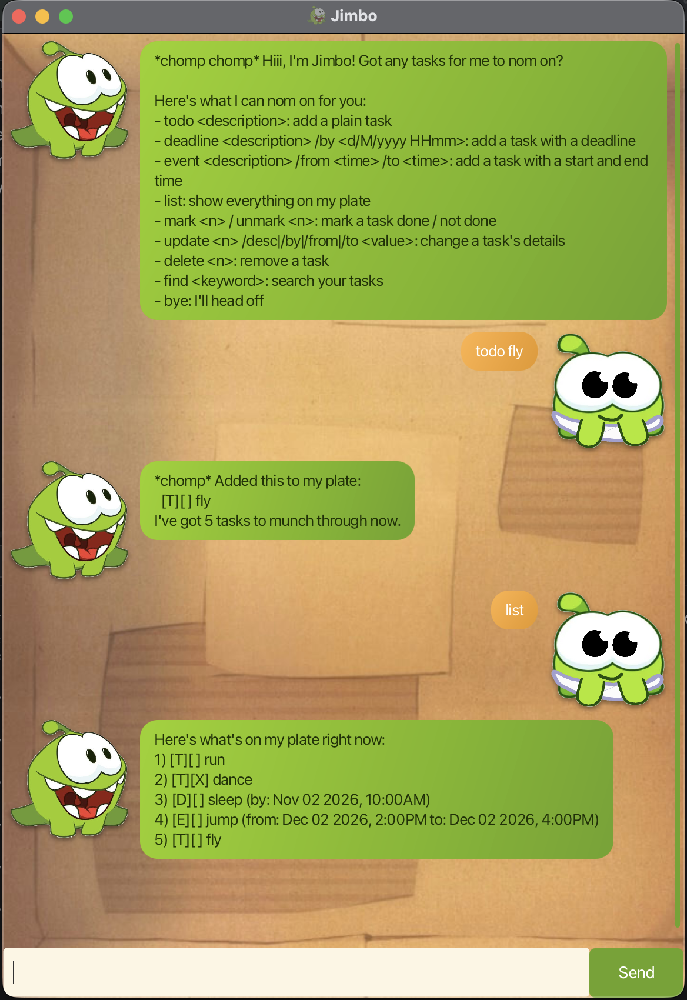

# Jimbo User Guide



Jimbo is a desktop chatbot that helps you track todos, deadlines, and events! Type
a command, hit enter, and Jimbo keeps your task list up to date and saved between
sessions.

## Quick start

1. Ensure you have Java 25 installed.
2. Download the latest `jimbo.jar` from the [Releases](https://github.com/junh4nn/ip/releases) page.
3. Run it with `java -jar jimbo.jar`.
4. Type a command in the input box and press Enter (or click Send).

## Features

> **Notes on the command format**
> - Words in `<angle brackets>` are parameters you supply, e.g. in `todo <description>`,
>   `<description>` is a parameter, so `todo read book` is a valid command.
> - Dates/times must be in `d/M/yyyy HHmm` format, e.g. `2/12/2026 1800` for
>   6:00PM on 2 December 2026.
> - Task numbers (`<n>`) are 1-based, matching the numbering shown by `list`.

### Adding a todo: `todo`

Adds a task with no date/time attached.

Format: `todo <description>`

Example: `todo read book`

```
*chomp* Added this to my plate:
  [T][ ] read book
I've got 1 tasks to munch through now.
```

### Adding a deadline: `deadline`

Adds a task that needs to be done by a specific date/time.

Format: `deadline <description> /by <d/M/yyyy HHmm>`

Example: `deadline submit report /by 2/12/2026 1800`

```
*chomp* Added this to my plate:
  [D][ ] submit report (by: Dec 02 2026, 6:00PM)
I've got 2 tasks to munch through now.
```

### Adding an event: `event`

Adds a task that spans a start and end date/time.

Format: `event <description> /from <d/M/yyyy HHmm> /to <d/M/yyyy HHmm>`

Example: `event project meeting /from 2/12/2026 1400 /to 2/12/2026 1600`

```
*chomp* Added this to my plate:
  [E][ ] project meeting (from: Dec 02 2026, 2:00PM to: Dec 02 2026, 4:00PM)
I've got 3 tasks to munch through now.
```

### Listing all tasks: `list`

Shows every task currently on your list.

Format: `list`

### Marking / unmarking a task: `mark`, `unmark`

Marks a task as done, or reverts it to not done.

Format: `mark <n>` / `unmark <n>`

Example: `mark 2`

### Updating a task: `update`

Changes one field of an existing task. `/desc` works on any task type; `/by` only
applies to deadlines, and `/from`/`/to` only apply to events.

Format: `update <n> /desc|/by|/from|/to <new value>`

Examples:
- `update 1 /desc read a different book`
- `update 2 /by 3/12/2026 0900`

### Deleting a task: `delete`

Removes a task from the list.

Format: `delete <n>`

Example: `delete 3`

### Finding tasks: `find`

Finds all tasks whose description contains the given keyword (case-insensitive).

Format: `find <keyword>`

Example: `find book`

### Viewing help: `help`

Shows the full list of commands again.

Format: `help`

### Exiting the program: `bye`

Format: `bye`

## Saving the data

Jimbo automatically saves your task list to disk after every command that changes
it (under `./data/jimbo.txt`). There's no need to save manually, and the file is
loaded automatically the next time Jimbo starts.

The `./` means this path is relative to wherever you launch the JAR from. So, if
you run `java -jar jimbo.jar` from, say, `~/Downloads`, Jimbo will create and use
`~/Downloads/data/jimbo.txt`, not a fixed location next to the JAR itself.

## Command summary

| Action | Format | Example |
|---|---|---|
| Todo | `todo <description>` | `todo read book` |
| Deadline | `deadline <description> /by <d/M/yyyy HHmm>` | `deadline submit report /by 2/12/2026 1800` |
| Event | `event <description> /from <d/M/yyyy HHmm> /to <d/M/yyyy HHmm>` | `event meeting /from 2/12/2026 1400 /to 2/12/2026 1600` |
| List | `list` | `list` |
| Mark / Unmark | `mark <n>` / `unmark <n>` | `mark 2` |
| Update | `update <n> /desc\|/by\|/from\|/to <value>` | `update 1 /desc new description` |
| Delete | `delete <n>` | `delete 3` |
| Find | `find <keyword>` | `find book` |
| Help | `help` | `help` |
| Exit | `bye` | `bye` |